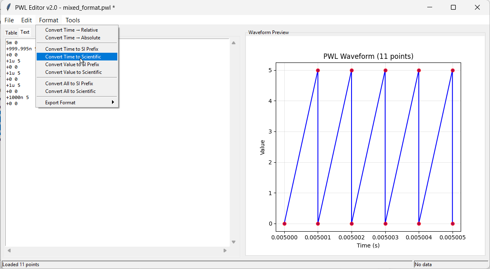

# PWL Editor

A professional editor for Piecewise Linear Waveform (PWL) files compatible with LTSpice, Micro-Cap and more. Suitable for voltage, current, or any signal waveforms.

## Key Features

- **Table-first editing** with inline cell edits and smart point insertion.
- **Live plotting** that mirrors table selections and highlights changes instantly.
- **Waveform repair assistant** to detect duplicate timestamps and time reversals.
- **Signal generators** for square, triangle, and saw profiles with guarded parameter entry.
- **Menu-driven conversions** for SI/scientific notation and ABS↔REL time formats.
- **Export presets** that enforce relative, absolute, or mixed timing during file export.
- **Text editor mode** with validation and undo support.
- **Import/Export** tooling compatible with LTSpice and MicroCap workflows.

## Quick Look

### Table View with Real-time Plotting


Edit points in the table while the plot highlights the same selection on the right.

### Text Editor Mode



Switch to raw PWL text with live validation and instant round-tripping back to the table.

## Waveform Tools

### Waveform Repair


Inspect the dataset for duplicate timestamps or time reversals, preview the fix, and apply it in place.

- **Max Slew Rate (V/s)** – when spreading duplicates, ensure the local slope stays below this ceiling.
- **Minimum Time Gap (s)** – enforce at least this spacing between duplicate points after repairs.
- **Duplicate strategy** – choose to leave as-is, center duplicates, or nudge them forward/back.
- **Time reversal strategy** – keep, sort, or drop segments that run backward in time.
- **Analyze / Preview / Apply** – re-scan the data, test the repair, then commit it when happy.

### Signal Generators

Each generator can append to the end of the waveform or replace the entire dataset. Previews update the plot before you apply changes.

#### Square Wave


- **Low / High level** – plateau values for the low and high states; swap them to invert the waveform.
- **Period (s)** – duration of one complete cycle.
- **Duty cycle (%)** – percentage of the period spent high.
- **Cycles** – number of cycles to generate.
- **Start time (s)** – timestamp where the generated segment begins when replacing the dataset; append mode always starts at the current end.
- **Edge duration (ppm)** – linear ramp length for each transition (rise/fall) expressed as parts per million of the period; automatically clamped so it never exceeds the available plateau.
- **Start high** – choose the initial state of the waveform.
- **Prefer relative output** – emit `+Δt` timestamps when enabled.
- **Apply mode** – choose whether to append to the end or replace the current waveform.

#### Triangle Wave


- **Low / High level** – minimum and peak amplitude (swap to flip the ramp direction).
- **Period (s)** – duration of one complete cycle.
- **Symmetry (0.001–0.999)** – fraction of the period spent rising; the remainder is the fall.
- **Cycles** – number of cycles to generate.
- **Start time (s)** – timestamp where the generated segment begins when replacing the dataset; append mode always starts at the current end.
- **Prefer relative output** – emit `+Δt` timestamps when enabled.
- **Apply mode** – choose whether to append to the end or replace the current waveform.

#### Saw Wave


- **Low / High level** – floor and ceiling of the ramp (swap to generate an inverted saw).
- **Period (s)** – duration of one complete cycle.
- **Ramp fraction (0–1)** – share of the period spent ramping up; the remainder is the reset interval (drop plus low hold).
- **Cycles** – number of cycles to generate.
- **Start time (s)** – timestamp where the generated segment begins when replacing the dataset; append mode always starts at the current end.
- **Reset edge (ppm)** – length of the linear drop back to the low level, in parts per million of the period; any remaining reset interval stays flat at the low level if the requested window is longer than available.
- **Prefer relative output** – emit `+Δt` timestamps when enabled.
- **Apply mode** – choose whether to append to the end or replace the current waveform.

## Installation

### Option 1: Pre-built Distribution (Recommended)

Download the latest release from: **[GitHub Releases](https://github.com/dotmjsc/PWL_Editor/releases)**

### Option 2: Run from Source

If you prefer to run from source code:

1. Ensure Python 3.7+ is installed

2. Install required dependencies:
   
   ```
   pip install tkinter matplotlib numpy si-prefix
   ```

3. Run the application:
   
   ```
   python src/pwl_gui.py
   ```

### For Developers

- Entry point: `src/pwl_gui.py`
- Build artifact: `python scripts/build.py`
- Core modules:
   - `src/controllers/` – table/text/plot coordination
   - `src/services/` – file IO, formatting, undo history, waveform repair
   - `src/dialogs/` – generator and repair UIs
   - `src/generators/` – waveform synthesis helpers

## PWL Format

PWL files define piecewise linear waveforms using time-value pairs. Values are unitless and can represent voltage, current, or any signal:

### Absolute Time Format

```
0 0
1m 1
2m 2
```

*Time=0s Value=0, Time=1ms Value=1, Time=2ms Value=2*

### Relative Time Format (LTSpice Delta Format)

```
0 0
+1m 1
+1m 2
```

*Time=0s Value=0, Time=previous+1ms Value=1, Time=previous+1ms Value=2*

**Note:** Relative time format (+ prefix) is LTSpice-specific and may not be compatible with other SPICE simulators like Microcap.

### Mixed Format

Both formats can be mixed in the same file. The editor provides smart conversion between formats while preserving the waveform shape.

## Export Format Settings

Export presets live under `Format → Export Format` and are applied when you run `File → Export...`: 

### Export Format Options

- **Preserve Mixed** - Keeps the original mix of absolute and relative time formats as entered.
- **Force Relative** - Converts all time values to relative format (+ prefix) in the exported file.
- **Force Absolute** - Converts all time values to absolute format in the exported file (required for MicroCap compatibility).

## Examples

The `examples/` folder contains sample PWL files:

- `simple_ramp.pwl` - Basic linear ramp waveform
- `mixed_format.pwl` - Demonstrates mixing ABS and REL formats
- `absolute_time.pwl` - Pure absolute time format example
- `digital_signal.pwl` - Complex digital signal with nanosecond timing
- `parser_testfile.txt` - Simple test file for parser development
- `repair_test_patterns.pwl` - Crafted edge cases for waveform repair scenarios

## Testing the Parser

You can test the PWL parser independently:

```bash
cd src
python pwl_parser.py
```

This will load and process the test file, demonstrating the parser's capabilities.

## Running Tests

This repository uses pytest with a minimal configuration:

- `pytest.ini` restricts discovery to the `tests/` folder and adds `src/` to `PYTHONPATH`.
- Run the full suite from the project root:

```bash
pytest -q
```

This avoids ad-hoc root-level scripts being picked up as tests and simplifies imports in test files (no `sys.path` hacks needed).

## License

GPL-3.0-or-later

## AI Tools Used

- Claude Sonnet 4 (Anthropic) - Code development and architecture
- GPT-5 (OpenAI) - Code development, bugfixes
