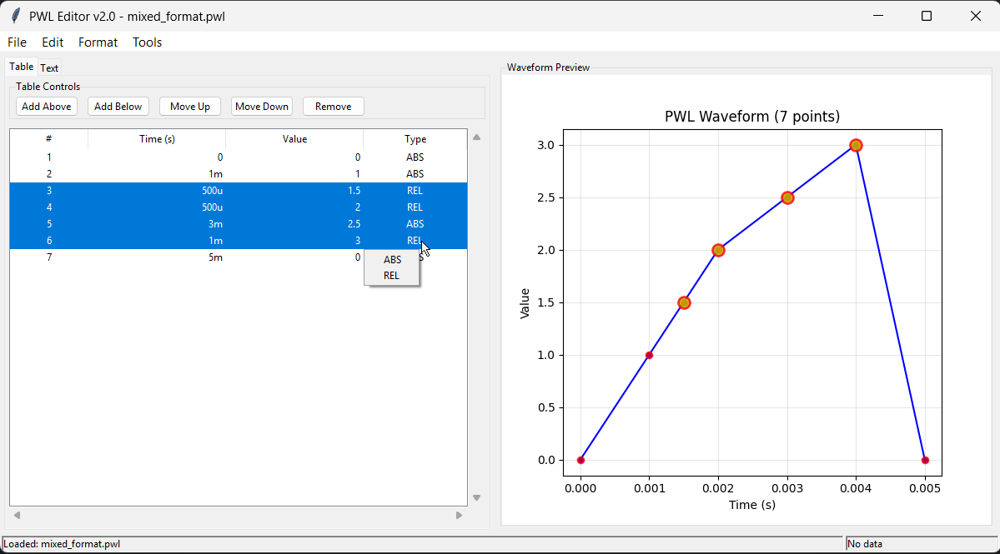

# PWL Editor

A professional editor for Piecewise Linear Waveform (PWL) files compatible with LTSpice. Suitable for voltage, current, or any signal waveforms.

## Screenshots

### Table View with Real-time Plotting


The main interface features a split view with an editable table on the left and real-time waveform plotting on the right. Selected table rows are highlighted in the plot for easy visualization.

### Text Editor Mode


Switch to text mode for direct PWL syntax editing with real-time validation and syntax highlighting.

## Features

- **Visual table-based editing** with inline cell editing
- **Real-time waveform plotting** with selection highlighting
- **Smart point insertion** - intelligent suggestions for new points
- **Smart ABS/REL time format conversion** with notation preservation
- **Multi-selection operations** (delete, move up/down, bulk edit)
- **Format conversion tools** - SI prefix, scientific notation, time/value conversion
- **Text editor** with syntax validation
- **Import/Export** PWL files

## Installation

### Option 1: Pre-built Distribution (Recommended)
Download the latest release from: **[GitHub Releases](https://github.com/dotmjsc/PWL_Editor/releases)**

### Option 2: Run from Source
If you prefer to run from source code:

1. Ensure Python 3.7+ is installed
2. Install required dependencies:
   ```
   pip install tkinter matplotlib numpy si-prefix
   ```
3. Run the application:
   ```
   python src/pwl_gui.py
   ```

### For Developers
- `build.py` - PyInstaller build script to create standalone executables

## PWL Format

PWL files define piecewise linear waveforms using time-value pairs. Values are unitless and can represent voltage, current, or any signal:

### Absolute Time Format
```
0 0
1m 1
2m 2
```
*Time=0s Value=0, Time=1ms Value=1, Time=2ms Value=2*

### Relative Time Format (LTSpice Delta Format)
```
0 0
+1m 1
+1m 2
```
*Time=0s Value=0, Time=previous+1ms Value=1, Time=previous+1ms Value=2*

**Note:** Relative time format (+ prefix) is LTSpice-specific and may not be compatible with other SPICE simulators like Microcap.

### Mixed Format
Both formats can be mixed in the same file. The editor provides smart conversion between formats while preserving the waveform shape.

## Export Format Settings

The text editor includes export format controls that determine how time formats are saved to files:

### Export Format Options

- **Preserve Mixed** - Keeps the original mix of absolute and relative time formats as entered
- **Force Relative** - Converts all time values to relative format (+prefix) when saving
- **Force Absolute** - Converts all time values to absolute format when saving - Necessary for MicroCap compatibility

## Examples

The `examples/` folder contains sample PWL files:

- `simple_ramp.pwl` - Basic linear ramp waveform
- `mixed_format.pwl` - Demonstrates mixing ABS and REL formats
- `absolute_time.pwl` - Pure absolute time format example
- `digital_signal.pwl` - Complex digital signal with nanosecond timing
- `parser_testfile.txt` - Simple test file for parser development

## Testing the Parser

You can test the PWL parser independently:

```bash
cd src
python pwl_parser.py
```

This will load and process the test file, demonstrating the parser's capabilities.

## License

GPL-3.0-or-later

## AI Tools Used

- Claude Sonnet 4 (Anthropic) - Code development and architecture
